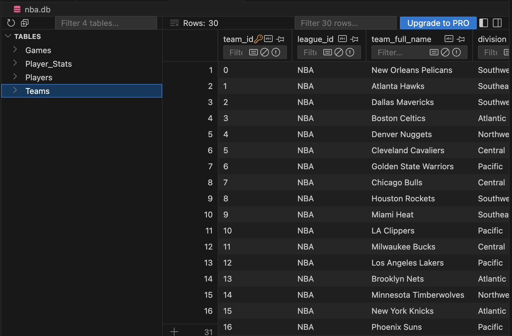
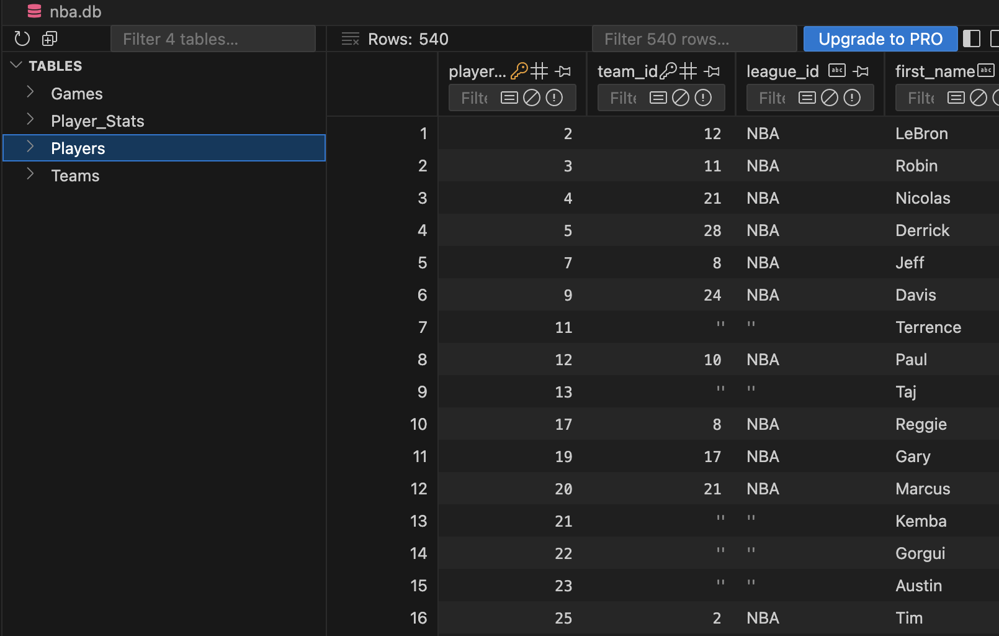
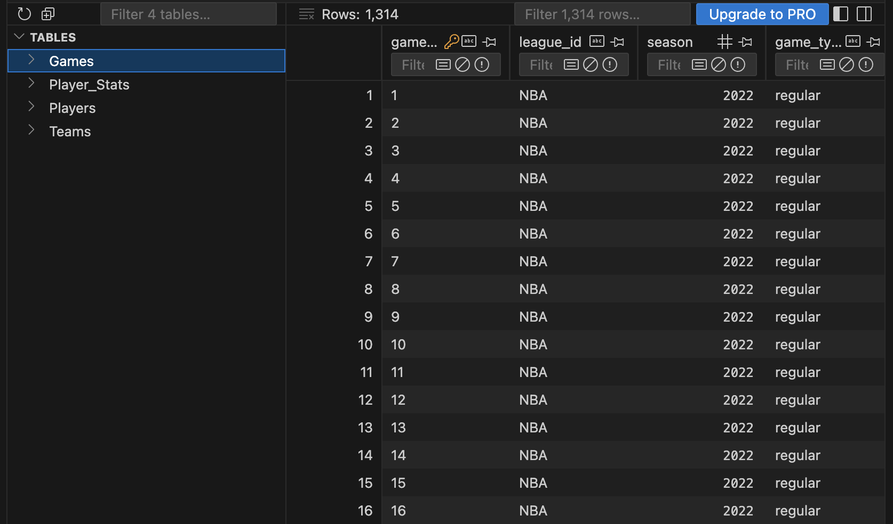
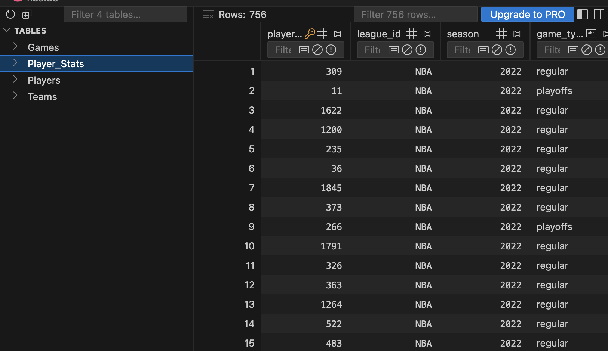
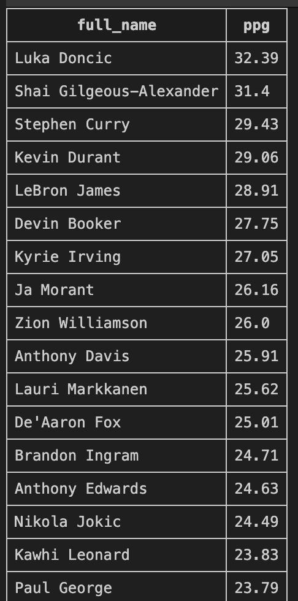
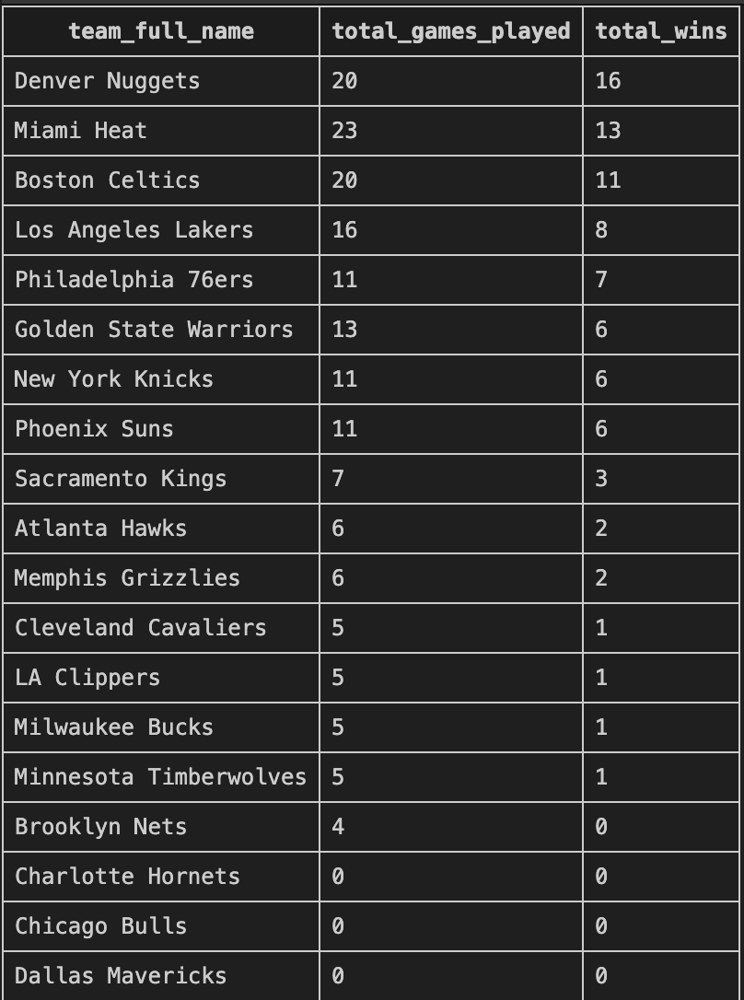
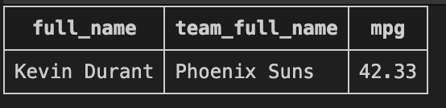
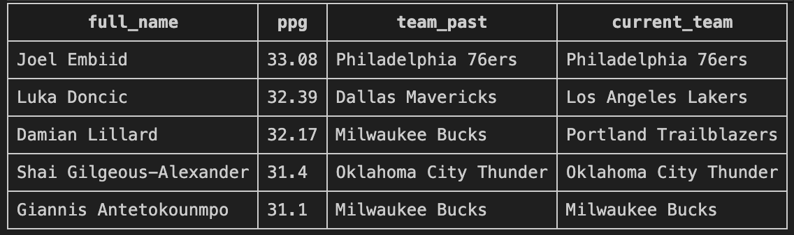
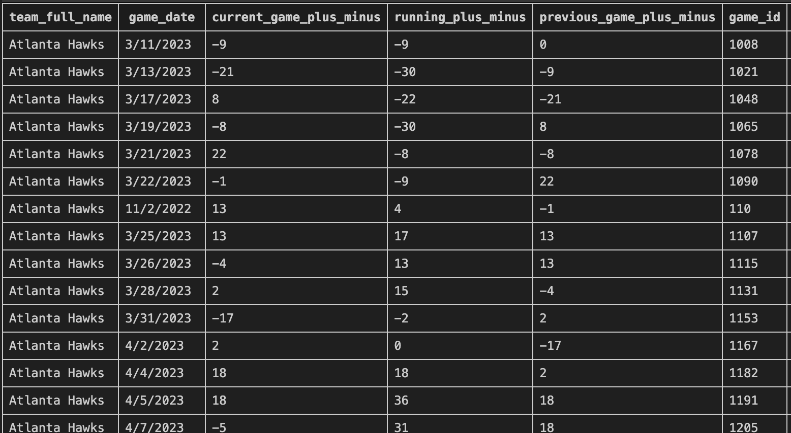

# SQL Guidebook

This dataset is originally from a dataset I have used in RStudio. I have split the data into four separate files and tables: Games, Player_Stats, Players and Teams.

First, in our terminal we run the following to create the database:

```bash
sqlite3 nba.db
```

We may create the first table in our database, which we will call "Teams." We will build upon this table as the primary table in our database. We can run the below query to create this table:

```sql
CREATE TABLE IF NOT EXISTS Teams (
  "team_id" VARCHAR(100) PRIMARY KEY,
  "league_id"  VARCHAR(100),
  "team_full_name" VARCHAR(100),
  "division" VARCHAR(100),
  "conference" VARCHAR(100),
  "status" VARCHAR(100)
);
```



We use team_id as our primary key, which will be referenced by other tables in the future. We create our Players table next — foreign key references our Teams table.

```sql
CREATE TABLE IF NOT EXISTS Players (
  "player_id"   INTEGER PRIMARY KEY,
  "team_id" INTEGER,
  "league_id"       VARCHAR(100),
  "first_name"   VARCHAR(100),
  "last_name" VARCHAR(100),
  "full_name" VARCHAR(100),
  "jersey_number" INTEGER,
  "position_simple" VARCHAR(100),
  "status" VARCHAR(100),
  FOREIGN KEY ("team_id") REFERENCES Teams("team_id")
);
```



We create final two tables, which I have listed below:


```sql
CREATE TABLE IF NOT EXISTS Games (
  "game_id" VARCHAR(100) PRIMARY KEY,
  "league_id" VARCHAR(100),
  "season"  INTEGER,
  "game_type" VARCHAR(100),
  "game_date" DATE,
  "game_time" TIMESTAMP,
  "game_status" VARCHAR(100),
  "home_team_id" INTEGER,
  "away_team_id" INTEGER,
  "home_score" INTEGER,
  "away_score" INTEGER,
  "point_difference" INTEGER,
  FOREIGN KEY ("home_team_id") REFERENCES Teams("team_id"),
  FOREIGN KEY ("away_team_id") REFERENCES Teams("team_id")
);
```



```sql
CREATE TABLE IF NOT EXISTS Player_Stats (
  "player_id" INTEGER,
  "league_id"  INTEGER,
  "season" INTEGER,
  "game_type" VARCHAR(100),
  "games_played" INTEGER,
  "games_started" INTEGER,
  "minutes" INTEGER,
  "total_seconds" INTEGER,
  "fgm" INTEGER,
  "fga" INTEGER,
  "fg_pct" INTEGER,
  "2fgm" INTEGER,
  "2fga" INTEGER,
  "2fg_pct" INTEGER,
  "3fgm" INTEGER,
  "3fga" INTEGER,
  "3fg_pct" INTEGER,
  "ftm" INTEGER,
  "fta" INTEGER,
  "ft_pct" INTEGER,
  "oreb" INTEGER,
  "dreb" INTEGER,
  "reb" INTEGER,
  "ast" INTEGER,
  "tov" INTEGER,
  "stl" INTEGER,
  "blk" INTEGER,
  "blka" INTEGER,
  "pf" INTEGER,
  "techs" INTEGER,
  "plusminus" INTEGER,
  "pts" INTEGER,
  "pfd" INTEGER,
  PRIMARY KEY ("player_id", "total_seconds")
);
```



We can then run the below commands (in separate lines in our terminal) to insert our data. I will provide just one instance, but we must do this for each of our tables:

```bash
.mode csv
.separator "," # for CSVs
.import --skip 1 data/Teams.csv Teams # skip the top row, ensure you have a data folder
```

## Query 1
In our first query, we will attempt to find the average points per game for each player who plays for a team in the Western conference. We will include the player's full name and their average points.

```sql

SELECT 
    full_name, 
    ROUND(SUM(PS.pts) * 1.0 / SUM(PS.games_played), 2) AS ppg
FROM players P 
LEFT JOIN Teams T
    ON P.team_id = T.team_id
LEFT JOIN Player_Stats PS
    ON P.player_id = PS.player_id
WHERE conference = 'Western' AND 
    game_type = 'regular' AND 
    T.status = 'active'
GROUP BY P.player_id
ORDER BY ppg DESC;
```



## Query 2
We will now use Common Table Expressions to calculate the total number of playoff games
played by each team in the 2022 season. We want to display the team and the total
number of games played. We want to display all teams, even those who did not make the playoffs that season.

```sql
WITH Playoff_Wins AS (
    SELECT
        T.team_full_name,
        SUM(
            CASE
                WHEN G.game_type = 'playoffs'
                     AND (
                         (G.home_team_id = T.team_id AND G.home_score > G.away_score) OR
                         (G.away_team_id = T.team_id AND G.away_score > G.home_score)
                     )
                THEN 1 ELSE 0
            END
        ) AS total_wins,
        SUM(
            CASE
                WHEN G.game_type = 'playoffs'
                     AND (G.home_team_id = T.team_id OR G.away_team_id = T.team_id)
                THEN 1 ELSE 0
            END
        ) AS total_games_played
    FROM Teams T
    LEFT JOIN Games G
        ON T.team_id = G.home_team_id OR T.team_id = G.away_team_id
    GROUP BY T.team_full_name
)

SELECT
    team_full_name,
    total_games_played,
    total_wins
FROM Playoff_Wins
ORDER BY total_wins DESC;

```



## Query 3

Here, we want to find the single player who has the highest minutes per game in the 2022 playoffs, considering players who have started at least 50% of the regular season games they played. We will also include the player's name and their average minutes per game.

```sql
SELECT 
    full_name, 
    team_full_name,
    ROUND(SUM(PS.minutes) * 1.0 / SUM(PS.games_played), 2) AS mpg
FROM Players P
LEFT JOIN Player_Stats PS 
    ON P.player_id = PS.player_id
LEFT JOIN Teams T
    ON P.team_id = T.team_id
WHERE game_type = 'playoffs' AND
    season = 2022 AND
    P.player_id IN (
        SELECT player_id
        FROM Player_Stats
        WHERE game_type = 'regular' AND
            season = 2022 AND
            games_started >= 0.5 * games_played
        )
GROUP BY P.player_id
ORDER BY mpg DESC
LIMIT 1;
```



## Query 4

Here, we want to do something more interesting. We will retrieve the top 5 players with the highest average points per game in the 2022 regular season, considering only players who have played for a team in the playoffs. We will include the player's full name, average points per game, and the team they are currently playing for.

As a note, if we see players who are not currently on the team they were on in 2022, we will have to manually change those.

```sql
SELECT 
    full_name, 
    ROUND(SUM(PS.pts) * 1.0 / SUM(PS.games_played), 2) AS ppg,
    T.team_full_name AS team_past,
    CASE 
        WHEN full_name = 'Luka Doncic' THEN 'Los Angeles Lakers'
        WHEN full_name = 'Damian Lillard' THEN 'Portland Trailblazers'
        ELSE T.team_full_name
    END AS current_team
FROM Players P 
LEFT JOIN Teams T
    ON P.team_id = T.team_id
LEFT JOIN Player_Stats PS
    ON P.player_id = PS.player_id
WHERE season = 2022 AND
    game_type = 'regular'
GROUP BY P.player_id, full_name, team_full_name
ORDER BY ppg DESC
LIMIT 5;
```



# Query 5

We will use CTE to keep a running tally of the plus/minus for a team throughout the 2022 season. We will use lags to keep track of the previous plus/minus.

Note: The JULIANDAY function will convert date strings to sortable numbers to be able to use lag in the first place.


```sql
WITH TeamGameStats AS (
    SELECT
        game_id,
        league_id,
        season,
        game_date,
        home_team_id AS team_id,
        home_score - away_score AS plus_minus
    FROM
        Games
    
    UNION ALL
    
    SELECT
        game_id,
        league_id,
        season,
        game_date,
        away_team_id AS team_id,
        away_score - home_score AS plus_minus
    FROM
        Games
),
RankedGameStats AS (
    SELECT
        t.*,
        tm.team_full_name,
        
        SUM(t.plus_minus) OVER (
            PARTITION BY t.team_id
            ORDER BY JULIANDAY(t.game_date), t.game_id 
            ROWS BETWEEN UNBOUNDED PRECEDING AND CURRENT ROW
        ) AS running_plus_minus,
        
        LAG(t.plus_minus, 1) OVER (
            PARTITION BY t.team_id
            ORDER BY JULIANDAY(t.game_date), t.game_id
        ) AS prev_game_plus_minus
    FROM
        TeamGameStats t
    JOIN
        Teams tm ON t.team_id = tm.team_id
)
SELECT
    team_full_name,
    game_date,
    plus_minus AS current_game_plus_minus,
    running_plus_minus,
    
    -- COALESCE: Data cleaning/transformation for LAG, replacing NULL (first game) with 0
    COALESCE(prev_game_plus_minus, 0) AS previous_game_plus_minus,
    
    game_id,
    team_id
FROM
    RankedGameStats
ORDER BY
    team_full_name,
    JULIANDAY(game_date),
    game_id;
```


