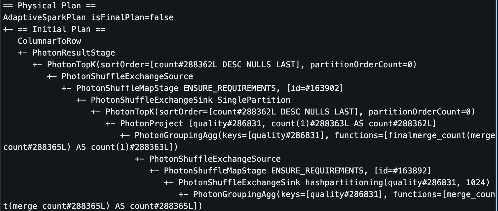
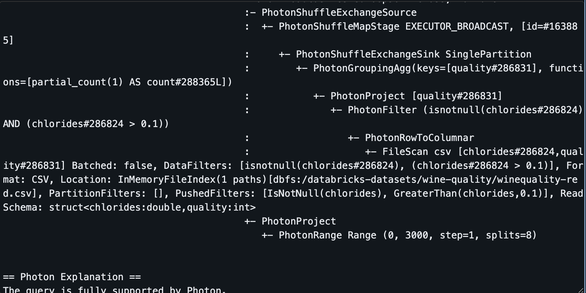

# Wines Dataset Manipulation using PySpark

For this assignment, I followed the same outline we were taught in class, so some of the assignment details may be out of order.

## 1. Data Processing Pipeline

For this assignment, I used the Red Wine quality dataset directly through databricks. I accessed it using the following file path:

```bash
path = "dbfs:/databricks-datasets/wine-quality/winequality-red.csv"


start = time.time()

df_spark = spark.read.csv(path, header=True, inferSchema=True, sep=";")
```

The data includes information about wine quality, specifically red wines, and some other attributes about the chemical composition. These include sulphates, chlorides, pH, residual sugar and other metrics.

I initially ran into some issues reading in the data, as it was reading as a CSV rather than a table, so I had to remember to put the separator as a semicolon to distinguish attributes in the table as well.

I used several data analytical functions, including `.groupBy`, `.filter`, `.withColumn` and used left joins with a small dataset I created on my own.

I also used `.repartition` to partition my queries, which seemingly provided better performance, as can be seen in the notebook.

```bash
# Repartition to different sizes
print("Testing different partition strategies...\n")

# Fewer partitions (4)
df_few = df_large.repartition(2)
start = time.time()
df_few.filter(col('quality') > 5).count()
few_time = time.time() - start
print(f"✓ Fewer partitions (4): {few_time:.2f}s")

```

## 2. Performance Analysis

I used the `.explain` function on a sample query to show the full path I had for this:

```bash

df_exp = df_large.filter(col('chlorides') > 0.1) \
    .groupBy('quality') \
    .count() \
    .orderBy(desc('count')) \
    .limit(10)

df_exp.explain()

```




Below is a brief analysis of my query optimization using partitioning in PySpark, including where filters were pushed down, some performance bottlenecks identified and I actually optimized the pipeline:

The core of Spark's performance lies in its Catalyst Optimizer and Lazy Evaluation. When you define your queries (either via DataFrame API or SQL), Spark doesn't execute them immediately. Instead, it builds a logical plan and passes it to the Catalyst Optimizer, which applies various rules to create the most efficient physical plan.

- Filter Pushdown (Predicate Pushdown): This is one of the most critical optimizations applied to the SQL queries.

     How it works: Spark pushes the WHERE chlorides > 0.1 and WHERE sulphates > 0.1 filter conditions down to the earliest possible stage—ideally, right when the data is read from the source file.

     Evidence in Physical Plan: The step in the physical plan which shows PushedFilters: [IsNotNull(chlorides), GreaterThan(chlorides,0.1)]. This confirms Spark didn't just read the entire CSV and then filter; it used the filter to limit the data read from disk . By filtering early, Spark drastically reduces the data volume before performing the expensive wide transformations like GROUP BY and ORDER BY.

In the queries, the most significant performance bottlenecks are the inevitable Shuffle Operations triggered by the GROUP BY and ORDER BY clauses. A shuffle is an expensive operation that moves and serializes data across the network between cluster nodes.

- Identified Bottleneck (Shuffle): Both queries use GROUP BY (to calculate average/count per category) and ORDER BY (to sort the final results). Both of these are "wide transformations" that necessitate a shuffle. The physical plan confirms this with multiple PhotonShuffleExchangeSink and PhotonShuffleExchangeSource stages.

- Pipeline Optimization (Filter Ordering): You proactively optimized the pipeline by applying the Filter Early principle, which minimizes the impact of the shuffle bottleneck.

     Example from Notebook: Your notebook explicitly showed a speedup by placing the .filter() before the .groupBy().count() operation, highlighting the fact that filtering the 14 million rows down first makes the subsequent aggregation much faster.

     Column Pruning: Spark's optimizer automatically performs Column Pruning. Since your final SELECT only requested quality, AVG(chlorides), and COUNT(*), Spark only reads the necessary columns (quality, chlorides, and implicitly, the column needed for COUNT(*)) from the source file and drops the others (volatile acidity, pH, alcohol, etc.) in the PhotonProject stage, reducing memory footprint and read I/O.


I also included caching at the end using `.cache()`

## 3. Actions vs. Transformations

I showed the lazy vs. eager distinction in transformations, as has been indicated in the notebook.