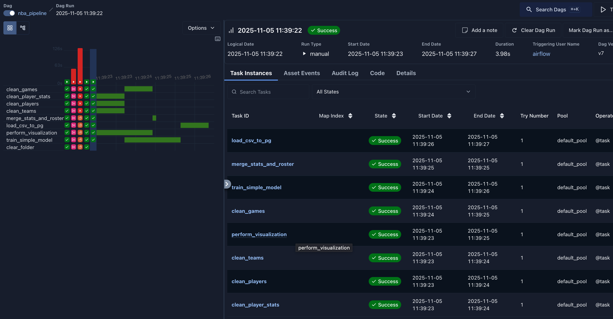
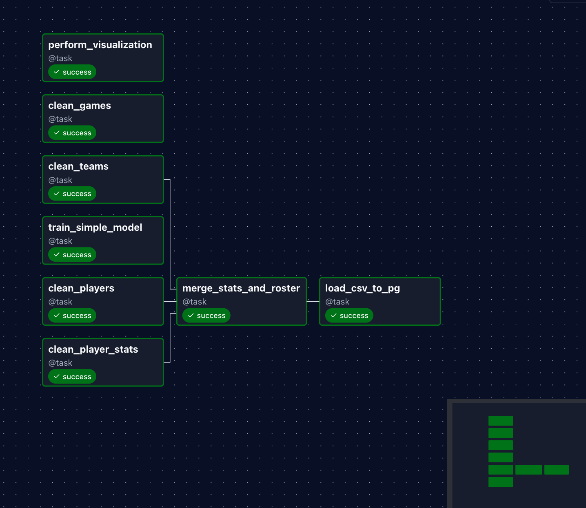
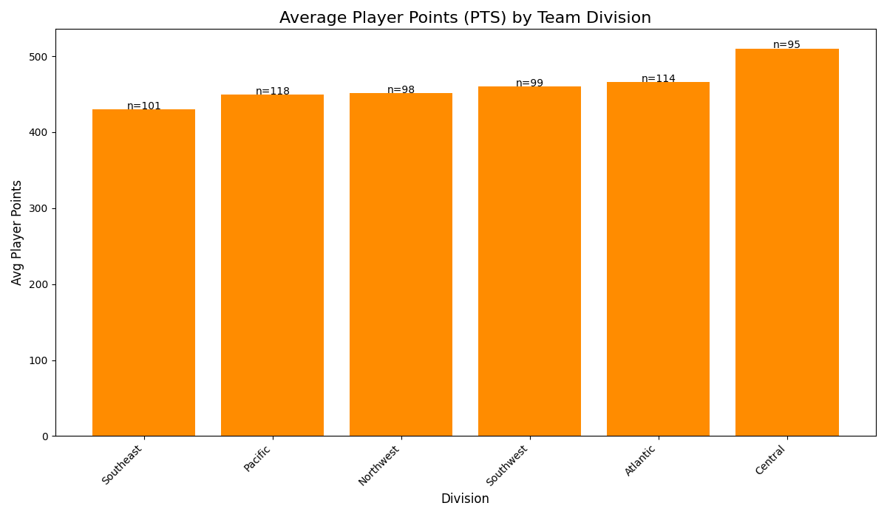

# 🏀 NBA Data Pipeline (Airflow DAG)

This project defines an **Apache Airflow DAG** that performs an end-to-end data pipeline for NBA data, including cleaning, merging, loading into Postgres, simple model training, and visualization.





---

## 📋 Overview

The DAG (`nba_pipeline`) performs the following steps:

1. **Clean CSVs** (`Players.csv`, `Teams.csv`, `Games.csv`, `Player_Stats.csv`)
2. **Merge** player, team, and stats data into one clean dataset
3. **Load** the merged dataset into a Postgres database
4. **Train** a simple linear regression model (`games_played ~ minutes`)
5. **Visualize** average player points by division
6. **Clean up** intermediate files while keeping the final model and visualization

---

## 🧱 Project Structure

project-root/
│
├── dags/
│ └── nba_pipeline.py # The main DAG script (this file)
│
├── data/ # Mounted into /opt/airflow/data in Airflow
│ ├── Players.csv
│ ├── Teams.csv
│ ├── Games.csv
│ ├── Player_Stats.csv
│
├── docker-compose.yml # Airflow + Postgres setup
└── README.md


---

## ⚙️ Requirements

- **Docker** and **Docker Compose**
- **Apache Airflow** (running via Docker)
- **PostgreSQL** (provided via the Airflow `docker-compose` stack)
- CSV data files placed in `/opt/airflow/data/` (mounted volume)

---

## 🧩 DAG Configuration

| Setting | Description |
|----------|--------------|
| **DAG ID** | `nba_pipeline` |
| **Start Date** | `2025-10-01` |
| **Schedule** | `@once` (runs only once when triggered) |
| **Schema** | `assignment` |
| **Target Table** | `nba_stats_merged` |
| **Output Directory** | `/opt/airflow/data` |
| **Postgres Connection ID** | `Postgres` (set in Airflow UI) |

---

## 🗂️ Data Input Files

Place these files in `/opt/airflow/data/` **before running the DAG**:

| File | Description |
|------|--------------|
| `Players.csv` | Basic player info (id, team, name, etc.) |
| `Teams.csv` | Team details (id, division, conference, etc.) |
| `Games.csv` | Game results (scores, times, etc.) |
| `Player_Stats.csv` | Player stats (points, minutes, etc.) |

---

## 🧠 Tasks Summary

| Task | Function | Output |
|------|-----------|---------|
| **clean_players** | Cleans player data | `players_clean.csv` |
| **clean_teams** | Cleans team data | `teams_clean.csv` |
| **clean_games** | Cleans game data | `games_clean.csv` |
| **clean_player_stats** | Aggregates player stats | `player_stats_clean.csv` |
| **merge_stats_and_roster** | Merges player/team/stats | `merged_nba_data.csv` |
| **load_csv_to_pg** | Loads final data into Postgres | `nba_stats_merged` |
| **train_simple_model** | Trains linear regression model | `simple_model.pkl` |
| **perform_visualization** | Creates bar chart (Avg PTS by Division) | `analysis_plot.png` |
| **clear_folder** | Cleans temporary files | Keeps final outputs |

---

## 🧰 Setup Instructions

### 1️⃣ Clone and Enter Directory
```bash
git clone <your-repo-url>
cd <your-repo-name>

## Dag Dependencies Overview

[Players, Teams, Games, Player_Stats]
            ↓
        Merge Stats
            ↓
       Load to Postgres
            ↓
   ┌────────┴─────────┐
   ↓                  ↓
Train Model     Visualization
   ↓                  ↓
        Cleanup Folder
