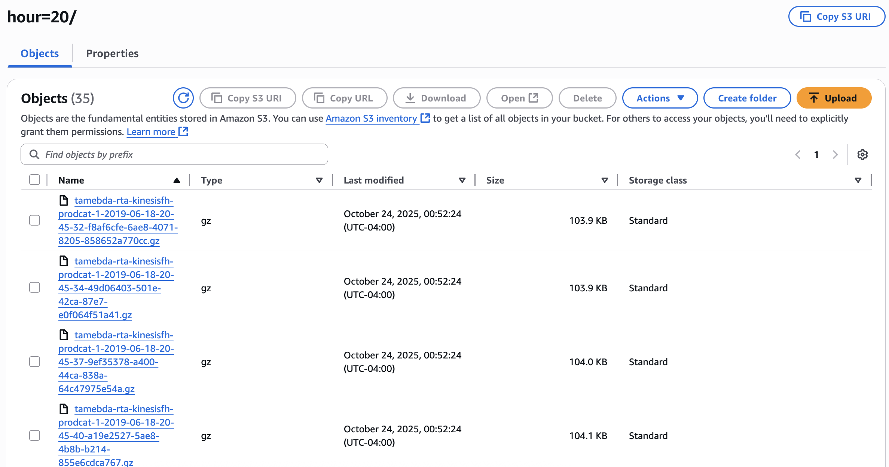

# AWS Practice

## 1. Batch Ingestion into S3

## 2. Real-Time Data Streaming into S3

## 3. Create a Crawler to Auto-Discover Schema

## 4. Create a Transformation Job in Glue Studio

## 5. Develop and Test ETL Scripts in Jupyter Notebook

## 6. Add a Trigger Function in AWS Glue

## 7. Create Glue Database using Athena

## 8. Visualize Data in QuickSight