# AWS Practice

## 1. Batch Ingestion into S3

## 2. Real-Time Data Streaming into S3

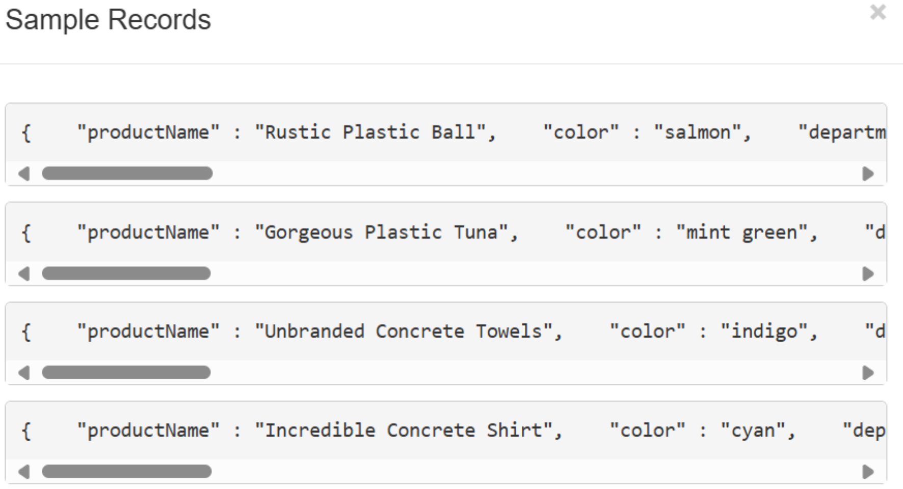

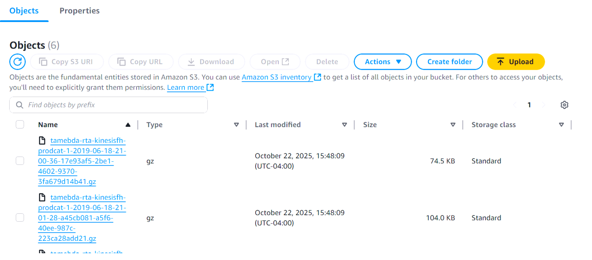

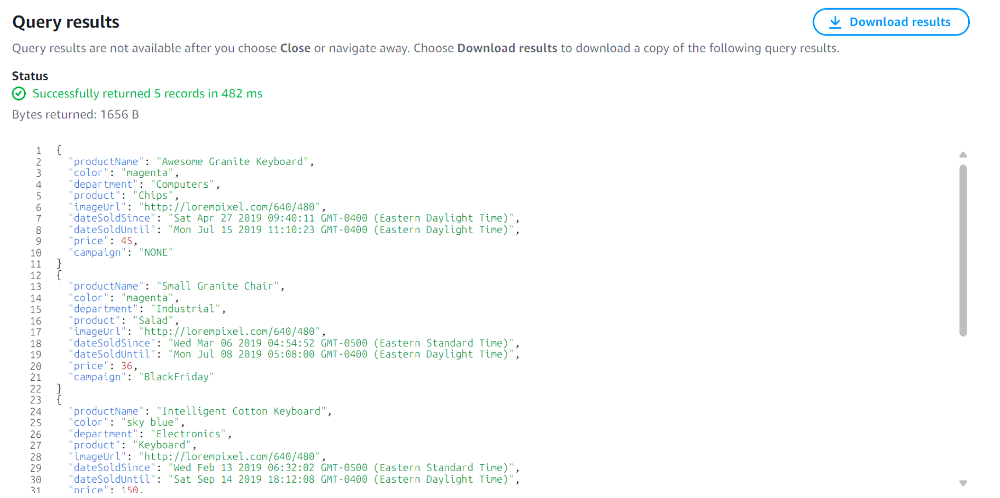

## 3. Create a Crawler to Auto-Discover Schema

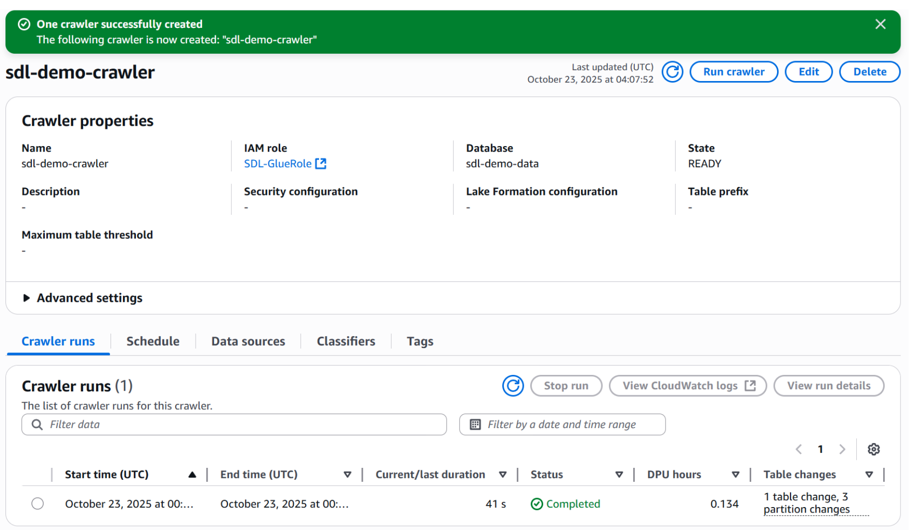
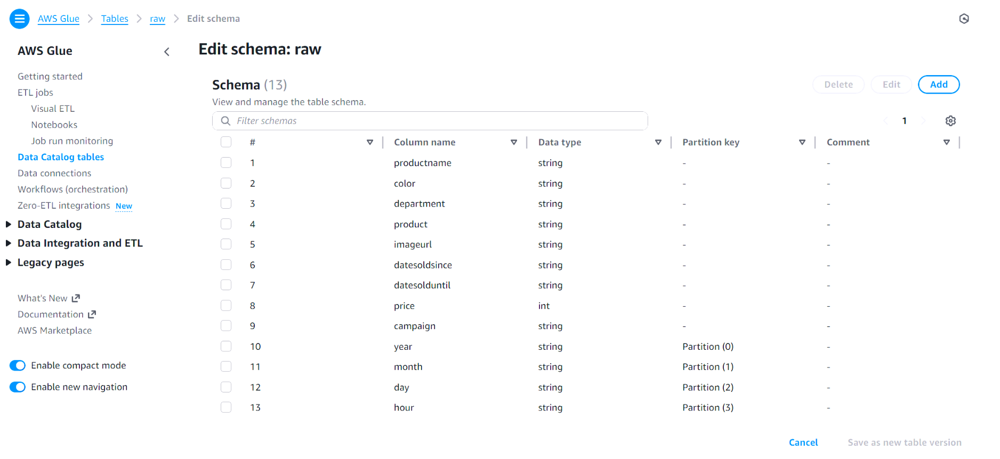

## 4. Create a Transformation Job in Glue Studio

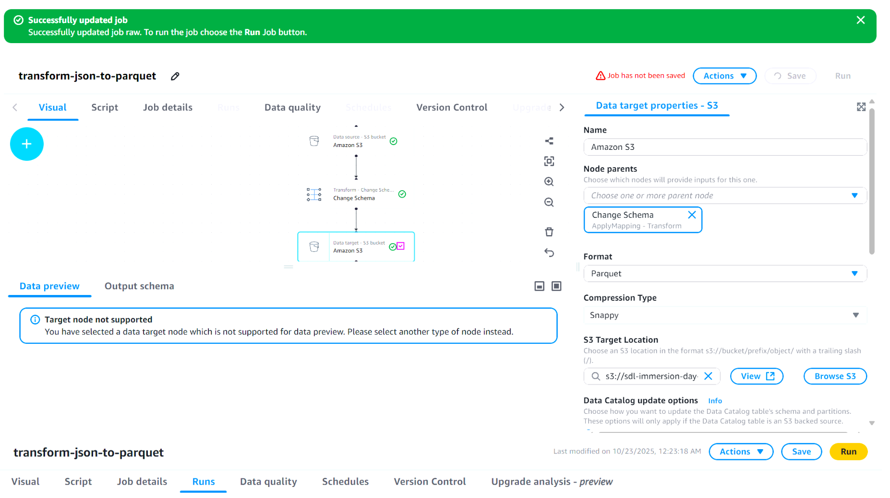
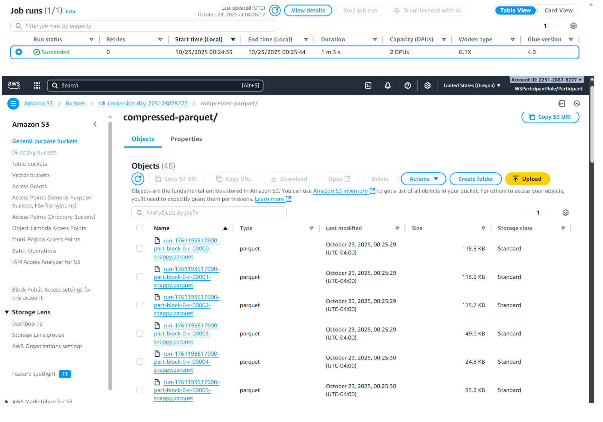

## 5. Develop and Test ETL Scripts in Jupyter Notebook

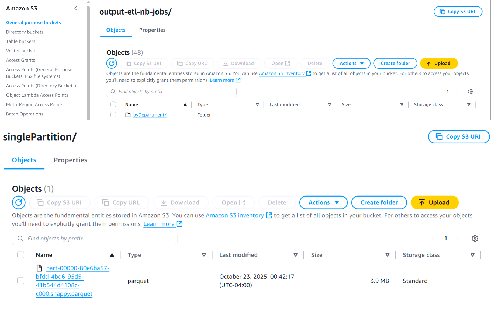
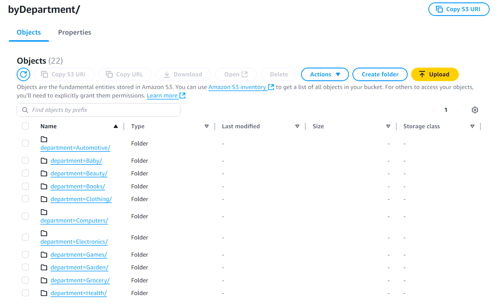

## 6. Add a Trigger Function in AWS Glue

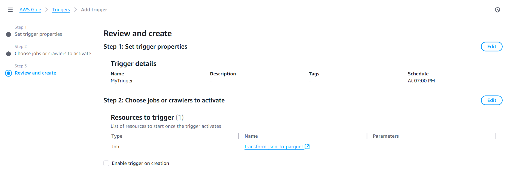

## 7. Create Glue Database using Athena

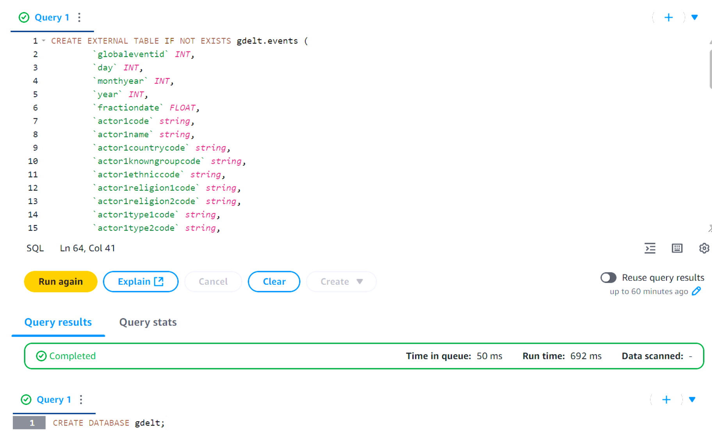
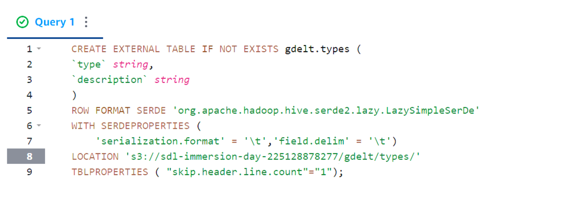
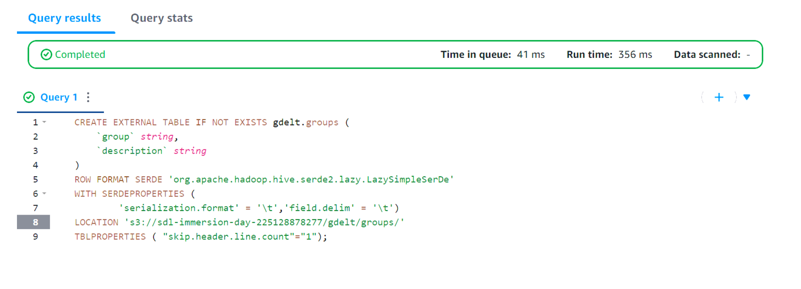
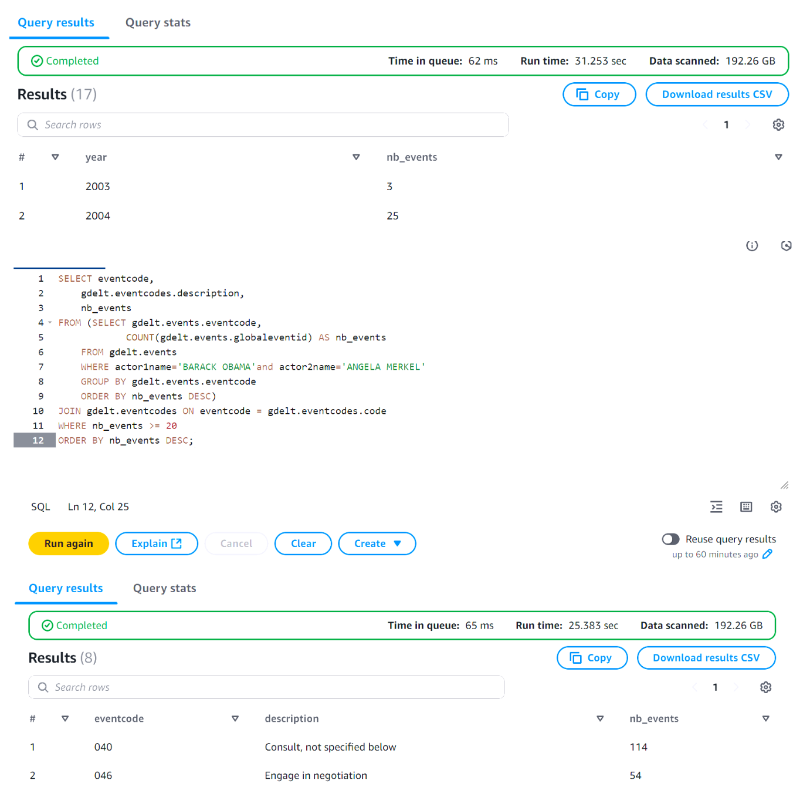

## 8. Visualize Data in QuickSight

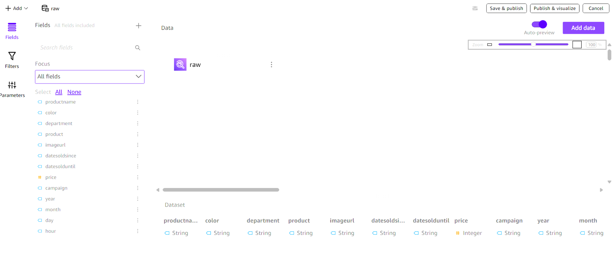
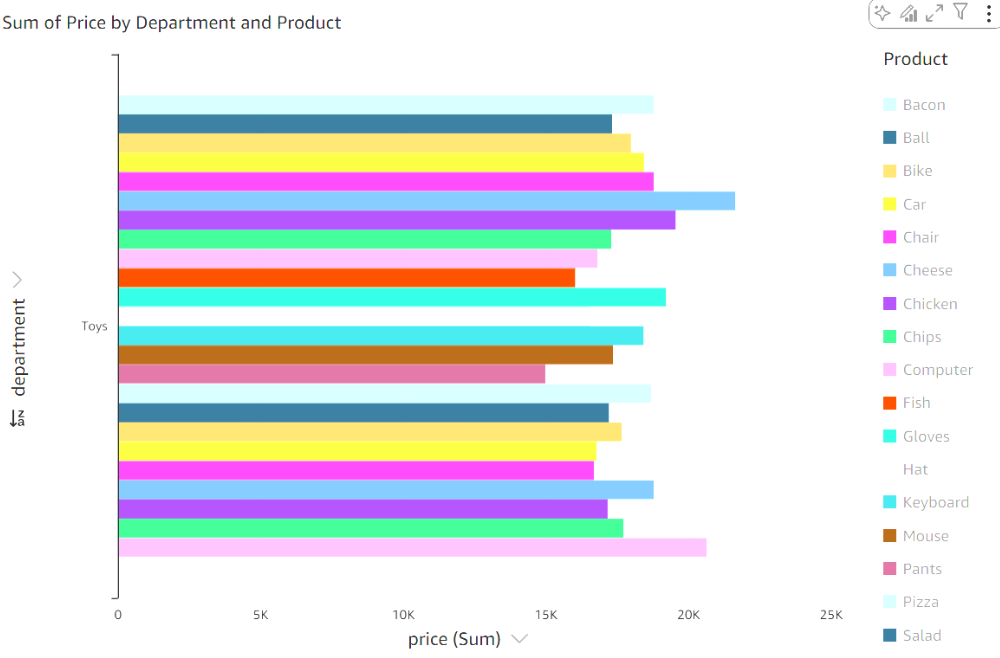
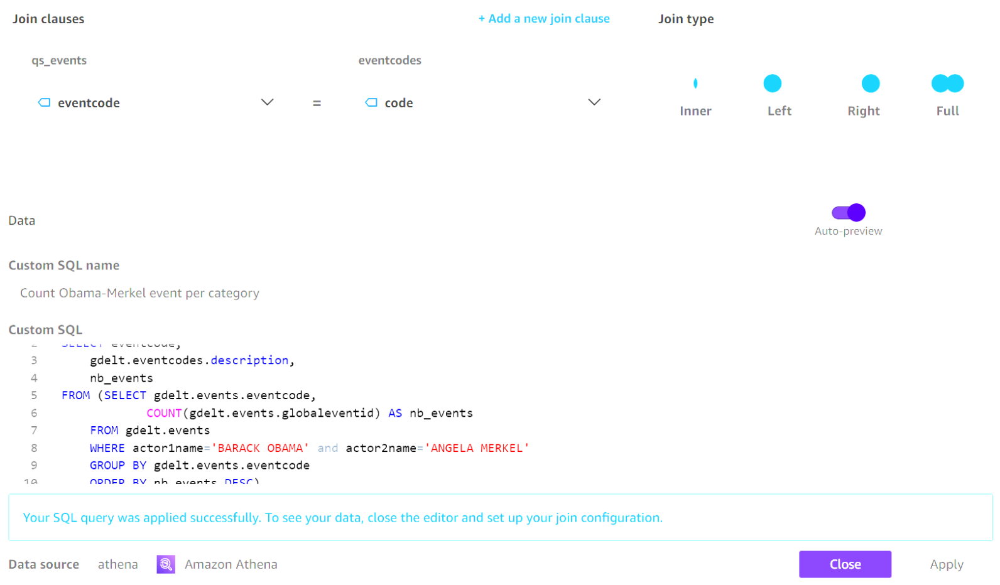
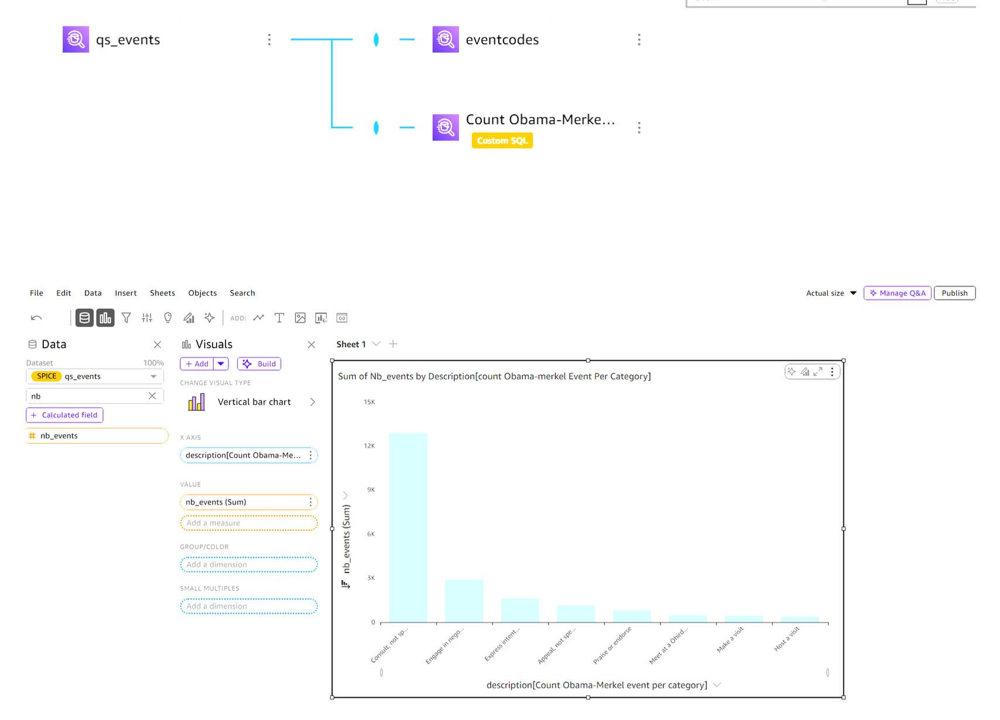